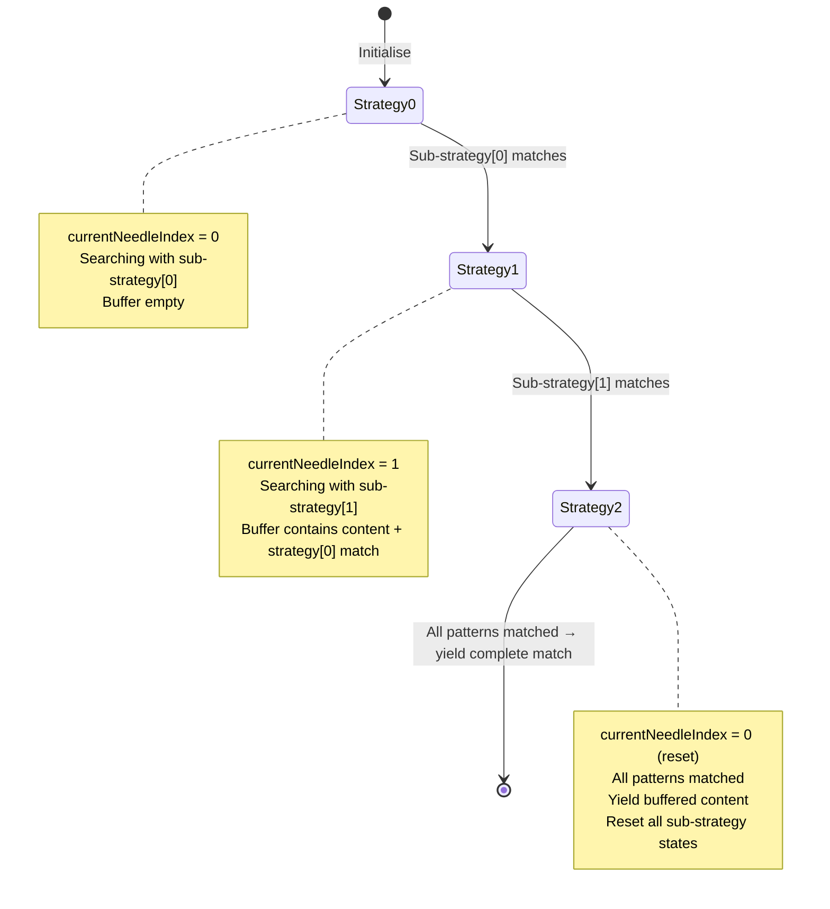

# Anchor Sequence Search Strategy

The `AnchorSequenceSearchStrategy` is a **meta-strategy** that composes multiple **cancellable** search strategies to match content delimited by a sequence of patterns. This is particularly useful for patterns like `{{placeholder}}`, `<tag attr="unknown value">`, or any multi-part delimiter pattern.

## Purpose

This meta-strategy orchestrates sequential pattern matching by coordinating multiple single-needle sub-strategies:

- ✅ **Composes cancellable strategies** - Requires sub-strategies with `finally` blocks for buffer preservation
- ✅ **Sequential matching** - Progresses through patterns in order (e.g., `{{`, then `}}`)
- ✅ **Mid-chunk cancellation** - Can stop sub-strategies when patterns are found by exiting iteration
- ✅ **Buffer access** - Retrieves buffered content from cancelled sub-strategies for complete match assembly

## Why Cancellable Sub-Strategies?

The meta-strategy **requires** cancellable sub-strategies because:

### Multiple Matches Per Chunk

A single chunk may contain multiple matches:
```
Chunk: "{{first}} and {{second}}"
        ↑       ↑     ↑        ↑
        └───────┘     └────────┘
         Match 1        Match 2
```

When the first `}}` is found:
1. **Stop iterating** the sub-strategy by breaking/returning from the loop
2. **Finally block executes** in the sub-strategy, preserving buffer to state
3. **Access buffered content** via `flush(state)`
4. **Yield** the complete match `{{first}}`
5. **Reset** and start searching for next `{{` in remainder of chunk

Blind-buffering strategies always hold on to a potential partial match at the end of the chunk, and that needs to be extracted when the orchestrating strategy wants to move to the next strategy / pattern.

The generator interface guarantees that `finally` blocks execute when iteration stops (via break, return, or loop completion). This ensures buffered content is preserved in state and accessible via `flush(state)`, allowing the meta-strategy to pass it to the next sub-strategy in sequence.

### Cancellation Mechanism

Cancellable strategies use `finally` blocks to preserve state when iteration stops:

```typescript
for (const result of subStrategy.processChunk(chunk, state)) {
  if (result.match) {
    // Found the needle! Exit iteration (triggers finally block)
    const matched = result.content;
    break; // or return - both trigger finally block
  }
}
// finally block in sub-strategy has executed, buffer preserved
const buffered = subStrategy.flush(state);
```

The generator interface guarantees `finally` blocks execute when iteration stops, ensuring buffered content is preserved in state.

## Compatible Sub-Strategies

All single-needle cancellable strategies can be composed:

| Strategy                                                                        | Buffering Approach      | Performance             | Use Case                                  |
| ------------------------------------------------------------------------------- | ----------------------- | ----------------------- | ----------------------------------------- |
| **[buffered-indexOf-cancellable](../buffered-indexOf-cancellable)**             | Blind                   | Fastest                 | Maximum performance, accept buffering     |
| **[looped-indexOf-cancellable](../looped-indexOf-cancellable)**                 | Smart (brute-force)     | Fast (small overhead)   | Balance performance and immediate yields  |
| **[indexOf-knuth-morris-pratt](../indexOf-knuth-morris-pratt)**                 | Smart (KMP prefix table)| Slower (JS-level)       | Benchmarking/educational purposes only    |

**Recommendation:** Use [buffered-indexOf-cancellable](../buffered-indexOf-cancellable) for sub-strategies unless you need immediate tail yielding, in which case use [looped-indexOf-cancellable](../looped-indexOf-cancellable).

## Overview

Unlike primitive strategies that match a single pattern, the anchor sequence strategy **orchestrates** multiple sub-strategies, progressing through them sequentially and buffering content until all patterns have been matched in order.

### Meta-Strategy Pattern

The anchor sequence strategy is generic and accepts any `SearchStrategy<TState>` implementations:

```typescript
const strategy = new AnchorSequenceSearchStrategy([
  new BufferedIndexOfCancellableSearchStrategy("{{"),
  new BufferedIndexOfCancellableSearchStrategy("}}")
]);
```

This composition pattern allows mixing different strategy types to create complex matching behaviour.

## How It Works

The strategy maintains:

1. **Sub-strategies array**: One strategy per delimiter/pattern in the sequence
2. **Current needle index**: Tracks which sub-strategy is actively searching
3. **Match buffer**: Accumulates content as each sub-strategy succeeds
4. **Strategy states**: Maintains separate state for each sub-strategy

### State Machine Flow



### Processing Logic

1. **Before first match**: Content from sub-strategy[0] is yielded immediately as non-matches
2. **After first match**: Content is buffered, sub-strategy advances to index 1
3. **Subsequent matches**: Continue buffering and advancing through sub-strategies
4. **Complete sequence**: When final sub-strategy matches, buffered content is yielded as a match
5. **Cycle reset**: After complete match, return to sub-strategy[0] with fresh states

## Performance Characteristics

- **Time Complexity:** O(n × k) where n is input size, k is number of sub-strategies
  - Each sub-strategy processes content independently
  - In practice, very efficient when using strategies like `BufferedIndexOfCancellableSearchStrategy` (indexOf-based)
- **Space Complexity:** O(s₁ + s₂ + ... + sₖ) + O(L)
  - Each sub-strategy maintains its own state (size sᵢ depends on strategy type)
  - The meta-strategy buffers match content (up to length L of complete match)

### Buffering Behaviour

- **Before first pattern**: No buffering, content flows through
- **After first pattern**: All content is buffered until sequence completes or fails
- **Worst case**: If terminal pattern never appears, entire content from first pattern to stream end is buffered
- **Example**: For `["{{", "}}"]`, input `"{{never_closed"` buffers `"{{never_closed"` until flush

## Strategy Composition Examples

### Two-Token Delimiters (Template Syntax)

```typescript
new AnchorSequenceSearchStrategy([
  new BufferedIndexOfCancellableSearchStrategy("{{"),
  new BufferedIndexOfCancellableSearchStrategy("}}")
]);
// Matches: "{{name}}", "{{value}}"
```

### Multi-Token Delimiters (HTML Attributes)

```typescript
new AnchorSequenceSearchStrategy([
  new BufferedIndexOfCancellableSearchStrategy('')
]);
// Matches: ''
```

### Mixed Strategy Types

```typescript
new AnchorSequenceSearchStrategy([
  new IndexOfKnuthMorrisPrattSearchStrategy("BEGIN"),
  new BufferedIndexOfCancellableSearchStrategy("-->"),
  new RegexSearchStrategy(/END/)
]);
// Demonstrates composability with different strategy implementations
```

## Comparison with Primitive Strategies

| Aspect                  | Primitive Strategy (e.g., `buffered-indexOf-cancellable`)          | Anchor Sequence Meta-Strategy                       |
| ----------------------- | ------------------------------------------------------------------- | --------------------------------------------------- |
| **Pattern**             | Single fixed pattern                                                | Sequence of patterns                                |
| **Sub-strategies**      | None                                                                | One per delimiter in sequence (requires cancellable)|
| **Cancellation**        | Uses `finally` blocks for state preservation                        | Requires sub-strategies with `finally` blocks       |
| **Match Control**       | Strategy decides when complete                                      | Meta-strategy orchestrates sub-strategy completions |
| **Use Case**            | Single needle (e.g., `"{{"`  or `"}}"`  in isolation)               | Sequential patterns (e.g., `["{{", "}}"]`)          |
| **State Tracking**      | Single state                                                        | State per sub-strategy + meta-state                 |
| **Match Completion**    | When pattern fully matched                                          | When all sub-patterns matched in sequence           |
| **Buffering**           | Pattern-dependent (blind or smart)                                  | Buffers from first match until sequence complete    |
| **Mid-chunk Handling**  | Not applicable (single pattern)                                     | Cancels sub-strategies to handle multiple matches   |

## Use Cases

Perfect for:

- **Template placeholders:** `{{variable}}`, `${expression}`, `%{value}%`
- **XML/HTML tags:** `<tag>`, `</tag>` pairs
- **Multi-part delimiters:** `<!--BEGIN-->`, `<!--END-->`
- **Structured patterns:** `<img src="`, `" alt="`, `"`
- **Sequential markers:** Patterns requiring multiple boundaries in order

Not ideal for:

- Single fixed patterns (use primitive strategy directly)
- Patterns where order doesn't matter
- Patterns with optional or alternative delimiters

## Related Strategies

**Sub-strategies (single-needle, cancellable):**
- **[buffered-indexOf-cancellable](../buffered-indexOf-cancellable)** - Blind buffering, fastest performance
- **[looped-indexOf-cancellable](../looped-indexOf-cancellable)** - Smart buffering with brute-force validation
- **[indexOf-knuth-morris-pratt](../indexOf-knuth-morris-pratt)** - Smart buffering with KMP algorithm (benchmarking)

**Alternative multi-pattern strategies:**
- **[buffered-indexOf-anchored](../buffered-indexOf-anchored)** - N-token sequential matching without composition (handles multiple needles internally)
- **[buffered-indexOf-canonical](../buffered-indexOf-canonical)** - Two-token start/end matching (non-cancellable, direct transformer)

## Design Rationale

The meta-strategy pattern provides:

1. **Separation of concerns**: Delimiter matching logic is delegated to specialised strategies
2. **Composability**: Any `SearchStrategy` implementation can be combined
3. **Reusability**: Sub-strategies can be shared across multiple meta-strategy instances
4. **Flexibility**: Easy to extend to new pattern types without modifying meta-strategy code
